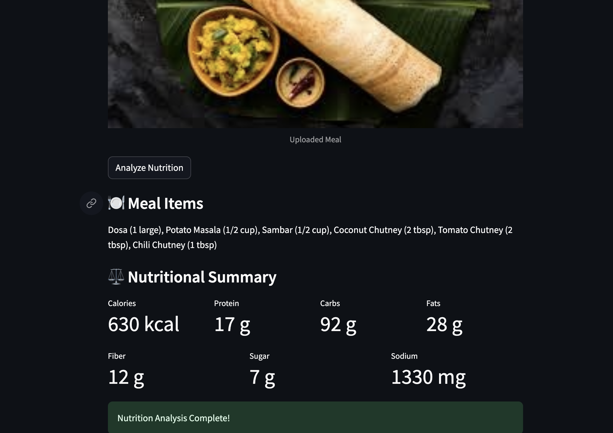

🥗 Smart Nutrition Analyzer

AI-Powered Food Recognition & Nutritional Breakdown

Upload a food photo and receive a professional nutritional analysis including calories, protein, carbohydrates, fats, fiber, sugar, and sodium. This app is powered by Google’s Gemini API and built with Streamlit for a sleek, interactive experience.

🚀 Features

AI-powered meal recognition from images

Structured, professional nutritional breakdown

Macro nutrients displayed in a clean, user-friendly layout

Handles multiple food items in a single meal

No JSON parsing required — robust and ready for end-users

Built with Python & Streamlit for fast deployment

📸 Demo

